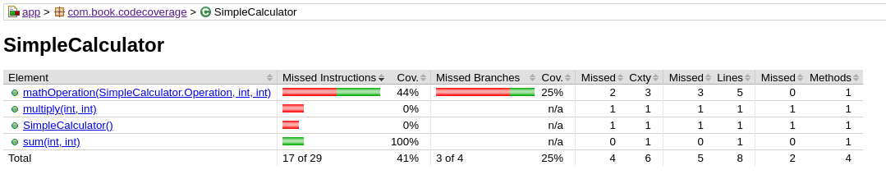

code coverage는 내가 작성한 테스트 케이스들이 얼마나 충분히 테스트가 되고 있는지를 측정하는 지표로서 백분위 퍼센티지로 표시가 됩니다. 수식으로 표현하자면 (테스트가 된 코드)/(전체 코드)*100 으로 표기할 수 있겠습니다. 어느정도로 테스트가 되고 있는지를 한눈에 파악할 수 있는 수치로 생각하면 되겠습니다.

안드로이드의 경우는 자바 언어를 사용하기 때문에 jacoco(https://www.jacoco.org/)라는 툴을 사용하게 됩니다. 뮤료 툴로서 프로젝트의 커버리지 정보를 라인별로, 브랜치별로(if나 switch문등), 파일별로 결과를 뽑을수 있고, 결과파일로는 xml이나 html파일로 생성할 수 있습니다. 

그렇다면 보통 프로젝트의 경우 어느 정도 수치를 목표치로 잡으면 될까요? 정답은 없습니다. 하지만 보통 라인 커버리지 기준으로 70-80%를 목표치로 가져가면 적당하다고 생각되고, 프로젝트의 상황이나 여건에 따라서 팀의 목표를 조정해나가면서 quality metric을 잡으면 됩니다.

# 커버리지 측정값의 종류
커버리지 측정값은 여러가지 종류가 있는데 보통은 라인 커버리지를 제일 많이 사용합니다. 하지만 커버리지 리포트를 보려면 각각의 지표가 무엇을 의미하는지 알아야 하기 때문에 정리해보려고 합니다. 

## instruction level
가장 작은 단위의 측정 지표

## branches
## cyclomatic complexity
## lines
## method
## class

# gradle과 연동

```java
apply plugin: 'jacoco'  // applying gradle jacoco plugin
task codeCoverageReport(type: JacocoReport, dependsOn: 'testDebugUnitTest') {
    group = "Reporting"
    description = "Generate Jacoco coverage reports after running tests."
    reports {
        xml.enabled = true // export xml report
        html.enabled = true // export html report
    }
    def classIncluded = [ '**/*.class' ]
    def classExcluded = [ '**/R.class', '**/R$*.class', '**/BuildConfig.*' ]
    classDirectories = fileTree(
            dir: 'build/intermediates/classes/debug',
            includes: classIncluded,
            excludes: classExcluded
    )
    sourceDirectories = files('src/main/java')  // specify source directory
    executionData = files('build/jacoco/testDebugUnitTest.exec') // specify execution data
}
 
 
// 만들어진 jacoco html을 열어주는 태스크 입니다.
task getCoverage(type: Exec, dependsOn: 'codeCoverageReport') {
    group = "Reporting"
    commandLine "xdg-open", "$buildDir/reports/jacoco/codeCoverageReport/html/index.html"
}
```

여기서 프로젝트의 상황에 따라서 수정이 필요한 부분은 아래와 같습니다.  

classExcluded: 결과에서 제외하고 싶은 클래스가 있다면 이곳에 추가합니다.
classDirectories: 해당 폴더에 class 파일들이 잘 생성되고 있는지 확인이 필요합니다. gradle의 버전에 따라서 class파일이 생성되는 위치가 다를 수도 있습니다. 
android gradle 3.3.2 버전의 경우는(com.android.tools.build:gradle:3.3.2) 이 위치가 build/intermediates/javac/debug/compileDebugJavaWithJavac/classes 로 수정되어야 합니다.
executionData: jacoco에 의해서 저장되는 exec파일의 위치를 지정합니다.  

# 리포트 해석하기

그러면 간단한 예제로 jacoco를 한번 실행해보고 그 결과를 어떻게 해석해야 하는지 알아보자. 우선 단순한 Calculator 클래스를 아래와 같이 작성 합니다

```java
public class SimpleCalculator {
 
    public enum Operation {
        SUM,
        MULTIPLY
    };
 
    public static int sum(int a, int b) {
        return a+b;
    }
 
    public static int mathOperation(Operation operation, int a, int b){
        if (operation.equals(Operation.SUM)){
            return sum(a,b);
        }else if(operation.equals(Operation.MULTIPLY)){
            return multiply(a,b);
        }else{
            return 0;
        }
    }
 
    public static int multiply(int a, int b) {
        return a*b;
    }
}
```
그리고 SimpleCalculatorTest라는 단위 테스트 클래스를 아래처럼 작성 합니다.

```java
public class SimpleCalculatorTest {
    @Test
    public void sum() {
        Assert.assertEquals(3, SimpleCalculator.sum(1, 2));
    }
 
    @Test
    public void mathOperation() {
        Assert.assertEquals(3, SimpleCalculator.mathOperation(SimpleCalculator.Operation.SUM, 1,2));
    }
}
```

이렇게 작성한 후 gradle로 다음과 같이 실행하면 jacoco 리포트인 html파일이 브라우져에서 열리게 됩니다.  

> ./gradlew getCoverage 

우리가 작성한 클래스중 SimpleCalculator를 클릭해서 자세하게 보면 아래처럼 보입니다. 

위의 테스트케이스를 보면 sum은 테스트가 되었지만 multiply는 테스트 되지 않았습니다. 아래 커버리지 리포트에 0%라고 정확히 명시되어 있습니다.
또한 mathOperation 테스트 케이스를 보면 3가지 경우가 있습니다. SUM으로 합을 구하는 경우, MULTIPLY로 곱을 구하는 경우 그외의 경우 이렇게 3가지 입니다. 3가지 중에서 테스트가 된 것은 첫번째 경우만 테스트가 되었습니다. 그래서 



# 커버리지 대상에서 제외하기
# custom filter 구현기??

reference
 - gradle 버전에 따라서 classes path가 다름, https://stackoverflow.com/questions/53374692/android-java-byte-code-missing-after-update-gradle-and-build-tools
 
